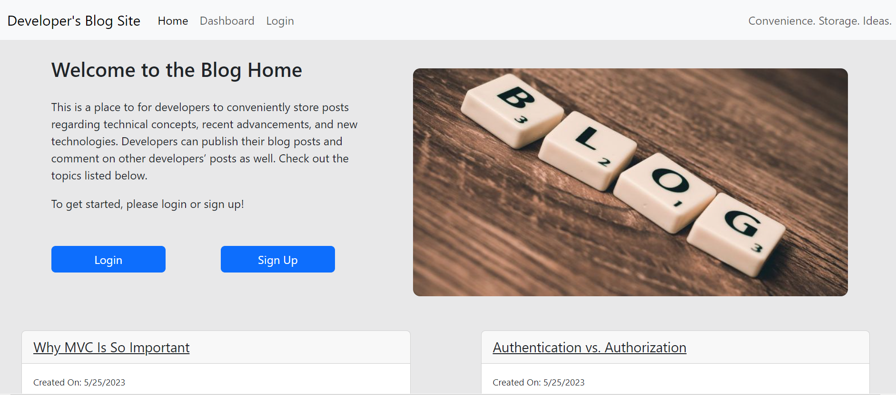
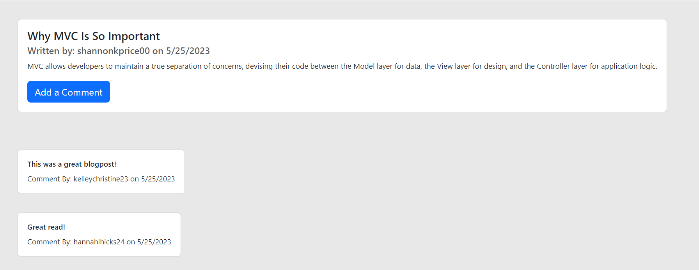
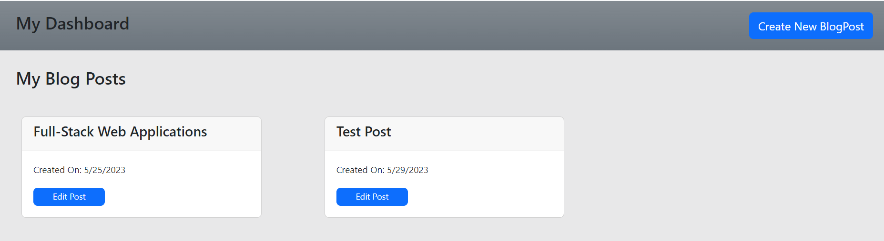

# CMS-Style-Tech-Blog

## Description
This application is a CMS-style blog site where developers can publish their blog posts and comment on other developers’ posts as well. It follows the MVC paradigm in its architectural structure, uses Handlebars.js as the templating language, Sequelize as the ORM, and the express-session npm package for authentication.

## Table of Contents
- [Installation](#installation)
- [Usage](#usage)
- [Credits](#credits)
- [License](#license)
- [Badges](#badges)
- [Tests](#tests)
- [Questions](#questions)

## Installation
N/A

## Usage
To open the application in your browser, click [here](https://young-caverns-47647.herokuapp.com/). The user will be able to view any existing blog post titles and the dates they were created on the homepage but will be prompted to either sign up or login to see any more.          Once logged in, the user can click on any blog title to view the post and any comments.          The user can access the navbar to navigate to the dashboard where the user can write a new blogpost or update/delete any of their existing blogposts by clicking on the edit post button.          When finished using the site, the user may manually logout using the navbar logout link or the site will automatically log the user out after one hour. 

## Credits
Tutorials Followed:  
[One To Many](https://sequelize.org/docs/v6/core-concepts/assocs/#:~:text=To%20create%20a%20One-To-One%20relationship%2C%20the%20hasOne%20and,Many-To-Many%20relationship%2C%20two%20belongsToMany%20calls%20are%20used%20together.)

## License
MIT License

## Badges

## Tests
N/A 

## Questions
GitHub Profile: [github.com/shannonkprice00](https://github.com/shannonkprice00) 
For further questions, you can reach me at shannonkprice00@gmail.com