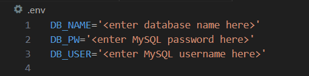

# CMS-Style-Tech-Blog

## Description
This application is a CMS-style blog site where developers can publish their blog posts and comment on other developers’ posts as well. It follows the MVC paradigm in its architectural structure, uses Handlebars.js as the templating language, Sequelize as the ORM, and the express-session npm package for authentication.

## Table of Contents
- [Installation](#installation)
- [Usage](#usage)
- [Credits](#credits)
- [License](#license)
- [Badges](#badges)
- [Tests](#tests)
- [Questions](#questions)

## Installation
To use this project, you will need to add the database name, MySQL username, and MySQL password to an environment variable file. 
     
Next, you will need to enter schema commands by entering the following commands from the root directory in the terminal:   `$ mysql -u root -p`   Type in your password if you have one   `$ source ./db/schema.sql;` 
To quit the MySQL shell you can type "quit".  You will also need to install any dependencies using the following command in the terminal:  `$ npm i`

## Usage
To run the program, use the following command from the root directory in the terminal:  `$ node server.js`  OR   `$ npm start`   

## Credits
Tutorials Followed:  
[One To Many](https://sequelize.org/docs/v6/core-concepts/assocs/#:~:text=To%20create%20a%20One-To-One%20relationship%2C%20the%20hasOne%20and,Many-To-Many%20relationship%2C%20two%20belongsToMany%20calls%20are%20used%20together.)

## License
MIT License

## Badges

## Tests
N/A 

## Questions
GitHub Profile: [github.com/shannonkprice00](https://github.com/shannonkprice00) 
For further questions, you can reach me at shannonkprice00@gmail.com